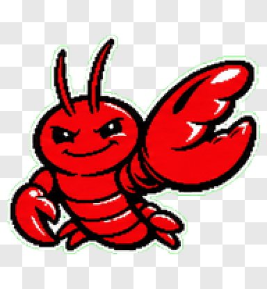
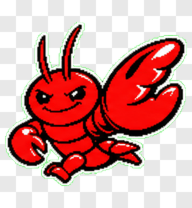
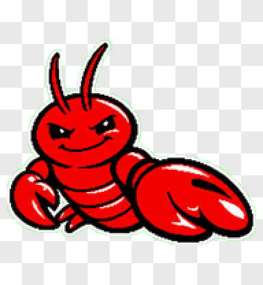
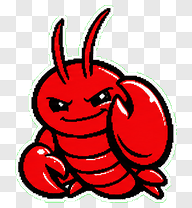
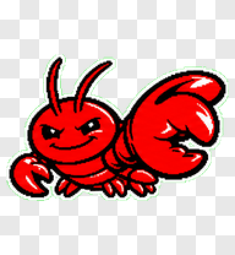
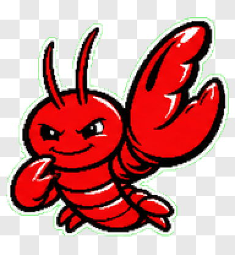
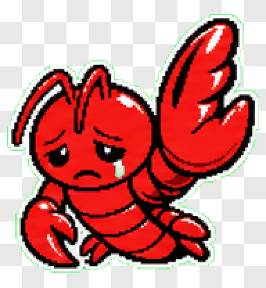
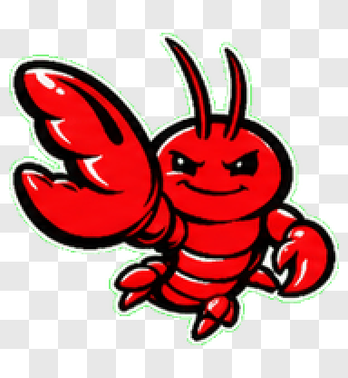
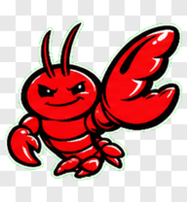

# OpenClaw Pet

Unofficial Codex pet assets inspired by OpenClaw.

<p align="center">
  
  
  
</p>

## Installation

Codex pets are loaded from:

```bash
~/.codex/pets/
```

Each pet should live in its own folder under that directory. A finished pet
folder should contain at least:

```text
pet.json
spritesheet.webp
```

For example:

```text
~/.codex/pets/openclaw/
  pet.json
  spritesheet.webp
```

This repository keeps the installable pet package in `openclaw/`:

```text
openclaw_pet/
  README.md
  LICENSE
  THIRD_PARTY_NOTICES.md
  assets/
    gifs/
      idle.gif
      running.gif
      waving.gif
  openclaw/
    pet.json
    spritesheet.webp
```

### Install With Codex

Copy and paste this prompt into Codex:

```text
Install the OpenClaw pet from this repository into my local Codex app pets directory.

Requirements:
- Find the completed OpenClaw pet package in this repository
- Copy the `openclaw/` package folder
- Put the completed pet package at ~/.codex/pets/openclaw/
- Make sure ~/.codex/pets/openclaw/pet.json exists
- Make sure ~/.codex/pets/openclaw/spritesheet.webp exists
- Create ~/.codex/pets/ if it does not already exist
- After copying, verify the installed files and tell me the final path
```

The key requirement is that Codex saves the finished pet package under
`~/.codex/pets/openclaw/`. After installation, restart the Codex app if the pet
does not appear immediately.

### Install Manually

Download or clone this repository, then copy the completed pet package into your
Codex pets directory.

```bash
mkdir -p ~/.codex/pets/openclaw
cp openclaw/pet.json openclaw/spritesheet.webp ~/.codex/pets/openclaw/
```

When finished, confirm the files are in the expected location:

```bash
ls ~/.codex/pets/openclaw
```

You should see `pet.json` and `spritesheet.webp`.

## Motions

| Idle | Running | Waving |
|---|---|---|
|  |  |  |

<details>
<summary>View all motions</summary>

| Waiting | Jumping | Review | Failed |
|---|---|---|---|
|  |  |  |  |

| Running Left | Running Right |
|---|---|
|  |  |

</details>

## License

This repository is released under the MIT License. See `LICENSE`.

OpenClaw-related attribution, third-party notices, and non-affiliation terms are
provided in `THIRD_PARTY_NOTICES.md`.

When redistributing this project, keep `THIRD_PARTY_NOTICES.md` with the pet
files so downstream users can see the OpenClaw attribution and disclaimer.

## Disclaimer

This is an unofficial fan-made pet asset package. It is not affiliated with,
endorsed by, sponsored by, or officially maintained by OpenClaw, Peter
Steinberger, or any OpenClaw maintainers.

OpenClaw names, logos, mascots, and other brand identifiers may be trademarks or
trade dress of their respective owners.
